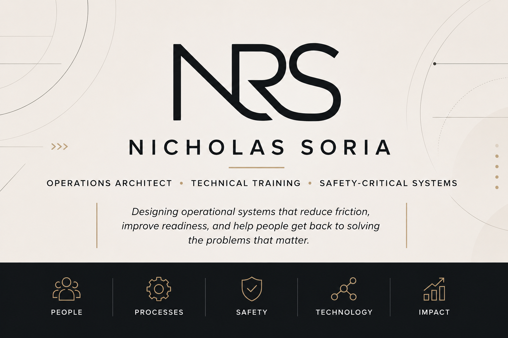

  

---

# About

I enjoy solving complex operational problems where people, processes, and technology intersect.

My work starts by understanding the mission, the people performing it, and how information moves through an organization. Rather than beginning with software, I look for opportunities to simplify workflows, reduce unnecessary friction, improve communication, and design systems that allow people to spend more time solving problems instead of managing processes.

My current focus is applying those principles to autonomous mobility, technical training, operational AI, and safety-critical environments.

---

## About This Portfolio

This GitHub is not a collection of production software. It is a portfolio of operational concepts, system architectures, and practical frameworks developed from experience in safety-critical operations.

While I am not a software engineer, I use GitHub to organize ideas, document research, prototype system designs, and demonstrate how technology can be applied intentionally to solve real operational problems.

# Featured Projects

| Project | Description |
|:---|:---|
| 🧠 **[CTMS – Cognitive Traffic Management System](https://github.com/sorianic/CTMS)** | A living research project documenting the architecture, concepts, and design principles behind safer human-directed autonomous mobility. |
| ⚙️ **Operational Systems Design (OSD)** | A practical framework for understanding, improving, and modernizing operational systems. _Documentation in Progress_|
| ✈️ **VATM – ATC Training Management** | Modernizing ATC qualification, readiness, and training management. _Developed for Navy ATC operational training. Public details are limited._|
| 🛡️ **Safety Intelligence System (SIR)** | Connecting operational knowledge, incidents, regulations, and corrective actions. _Coming Soon_ |
| 🚨 **AV Rider-Support Incident Command** | A structured incident management and escalation framework for autonomous mobility. _Coming Soon_|
| 🎓 **AV Operator Train-the-Trainer** | Instructor development and standardization for autonomous vehicle operations. _Coming Soon_|

---

# Current Focus

- Operational Systems Design
- Autonomous Mobility
- Operational AI
- Technical Training
- Safety-Critical Systems
- Human Factors
- Process Improvement

---

# Design Philosophy

> Technology should support operations—not define them.

Every project begins with the same questions:

- What is the mission?
- How does the work actually happen?
- Where does information break down?
- What creates unnecessary friction?
- Can the process be simplified before it is automated?
- Will technology genuinely improve safety, efficiency, or readiness?

The objective is simple:

> **Give people more time to solve real problems.**

---

# Professional Background

- 13+ years in U.S. Navy Air Traffic Control
- Chief Petty Officer
- Technical Training & Qualification Management
- Operational Readiness
- Safety Investigations, Mishap Analysis & Risk Management
- Process Improvement
- Systems Thinking
- AI-Assisted Operational Design

---

# Education

**Bachelor of Science – Business & Technology (Artificial Intelligence)**  
California Miramar University *(Expected Spring 2028)*

---

## Side Quest

### 🐾 Paw & Hearth

A passion project my wife and I are building to support animal rescues and help connect people with animals in need.

While most of my work focuses on operational systems and safety-critical environments, Paw & Hearth lets me apply those same design principles to something we both care deeply about.

*Sometimes solving problems just means helping a dog find a home.*

---

# Connect

💼 **LinkedIn**  
https://www.linkedin.com/in/nic-soria-821543336

📧 **Email**  
nicsoria@gmail.com

---

*"Technology should support operations—not define them."*

